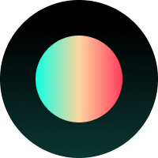

    
    <h1 align="center">Supernova</h1>
    

        The open-source superhuman productivity app.
    

    

        <a href="https://discord.gg/MUHH7rn2jV">Discord</a>
        ·
        <a href="https://trysupernova.one">Website</a>
        ·
        <a href="https://github.com/trysupernova/supernova/issues">Issues</a>
        ·
        <a href="https://github.com/trysupernova/supernova/milestones">Roadmap</a>
    

## About Supernova

Supernova is a superhuman productivity app that's fast, beautiful, keyboard-based, integration-rich, and open-source. Features include task management and calendar integrations. It was designed to work with you, rather than against you.

Our goal is to make Supernova the best productivity app on the market. We're building it with the community, for the community. We're open-source, so you can see what we're working on and contribute to the project. We're also transparent, so you can see our roadmap and what we're working on next.

### Built with

- Next.js w/ Tailwind
- Node.js

## Contributing

See [CONTRIBUTING.md](./CONTRIBUTING.md) for more information.
